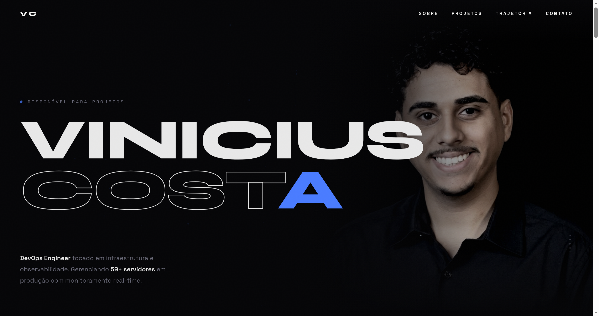
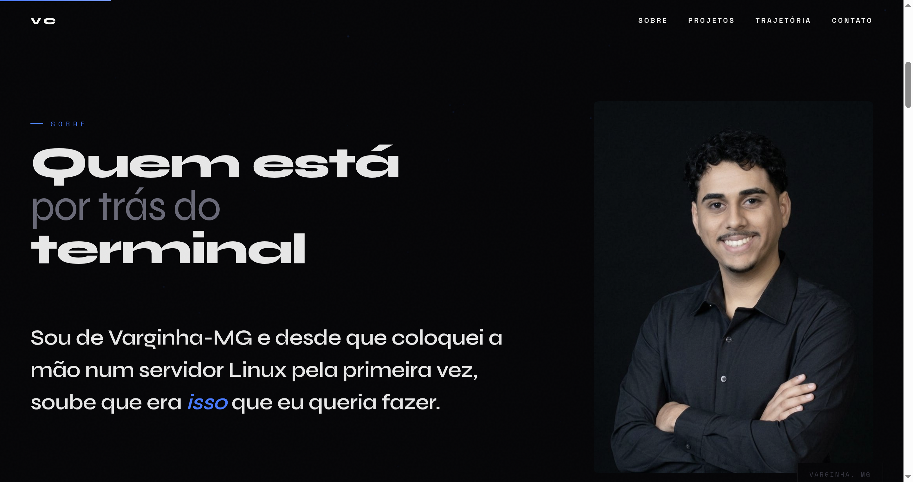

# viniciuscosta.dev

**Portfolio pessoal | DevOps Engineer**

 

  

 

  

 

## Stack

- **Design:** HTML, CSS puro, JavaScript vanilla (zero frameworks)
- **Fontes:** Syne, Space Grotesk, Space Mono
- **Efeitos:** Canvas particles, parallax scroll, 3D tilt, magnetic hover, custom cursor
- **Hospedagem:** GitHub Pages

## Funcionalidades

- Loader com animacao letra por letra
- Cursor customizado com mix-blend-mode
- Particulas interativas no canvas de fundo
- Scroll parallax no hero e fade progressivo
- Cards de projetos com terminal mockup e drag horizontal
- Timeline interativa com linha de progresso por scroll
- Totalmente responsivo (desktop, tablet, mobile)

## Contato

**Vinicius Emanuel Costa** | DevOps Engineer

